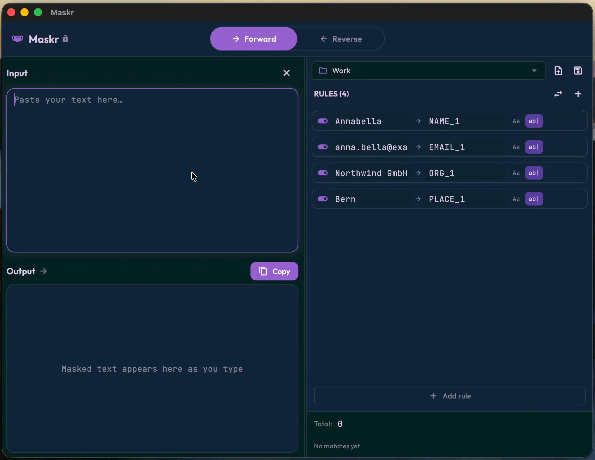

# Maskr

A macOS desktop app for reversible text pseudonymization.



## Features

- Define literal find/replace rules (source → target) and apply them to pasted text.
- Reverse the operation to restore the original text.
- Simultaneous, non-cascading replacement: a single left-to-right scan, longest match wins, ties broken by list order.
- Patterns are always literal — never treated as regex.
- Per-rule options: enabled/disabled, case-sensitive, whole-word.
- Forward/Reverse direction toggle.
- Save and load rules as named profiles.
- Rules and profiles persist to JSON files in the user's home directory.
- Warnings for duplicate patterns, duplicate replacements, and roundtrip risk (when a replacement string also appears in the input).
- 100% offline — nothing leaves the device.

## How it works

You define a list of literal find/replace rules. The app scans the input text once, left to right, and replaces matches simultaneously so that replacements never cascade into one another. The same rule set can be applied in reverse to restore the original text.

## Installation
Download Maskr-0.1.dmg from the Releases and drag it into your Applications folder.

## Getting started

```sh
flutter pub get
flutter run -d macos
flutter test
```

Requires Dart SDK >=3.2.0 and Flutter >=3.16.0. macOS and Linux targets are present.

## Project structure

- `lib/domain/` — models and the pure-Dart replace engine.
- `lib/application/` — Riverpod providers.
- `lib/ui/` — widgets and theme.
- `test/` — `replace_engine_test.dart` covers the engine; `widget_test.dart` is a smoke test.

## Privacy

Maskr is fully offline. Text, rules, and profiles stay on your device; nothing is sent anywhere. Rules and profiles are stored as JSON files in your home directory (`~/.masktext_rules.json`, `~/.masktext_profiles.json`, `~/.masktext_selected_profile.json`).
